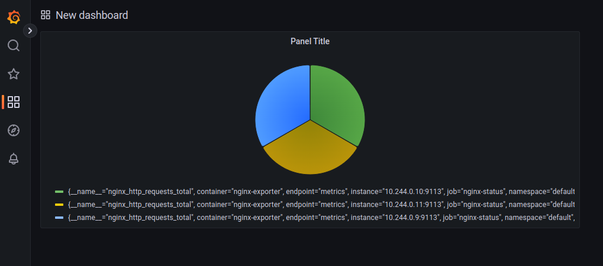

# yunusovtr_platform
yunusovtr Platform repository

## Домашнее задание к уроку №2

- Подготовил репозиторий yunusovtr-platform для работы, внёс необходимые файлы для работы автотестов
- Задание: Разберитесь почему все pod в namespace kube-system восстановились
  - поды для etcd, kube-apiserver, kube-controller-manager, kube-scheduler являются статичными и управляет ими kubelet ноды, которая в minikube имеет имя minikube. Манифесты для них находятся в обычных файлах /etc/kubernetes/manifests.
  - core-dns и kube-proxy - это Deployment и DaemonSet, манифесты которых сохраняются в базе etcd и становятся доступными после поднятия пода etcd.
- Подготовил Dockerfile для web-сервера nginx по условиям
- Создал манифест пода web, создал основной и инит-контейнеры, проверил работоспособность пода и открытие целевой страницы
- Склонировал репозиторий https://github.com/GoogleCloudPlatform/microservices-demo
- Собрал образ hipster-frontend, отправил в docker hub
- Задание со *: добавил все переменные окружения, необходимые для успешного старта контейнера, и статус пода после старта стал Running.

## Домашнее задание к уроку №3

- Запустил кластер kind состоящий из 4 нод
- Создал и запустил ReplicaSet, добавив описание селектора и переменных окружения
- Проскалировал ReplicaSet до 3, используя команду ad-hoc: kubectl scale rs frontend --replicas=3, и используя изменения в манифесте
- Обновление тэга образа контейнера в манифесте ReplicaSet не привело после применения манифеста к обновлению образов контейнеров подов, потому что обновление шаблонов контейнеров не относится к сфере ответственности ReplicaSet.
- Удалил все поды после изменения тега в манифесте и получил обновление образа в контейнерах.
- Собрал образ yunusovtr/hipster-paymentservice с тегами v0.0.1 и v0.0.2 и успешно запустил с ними репликасет с 3 репликами
- Скопировал манифест репликасета в деплоймент, стартовал
- Поменял тег образа в деплойменте и применил манифест, проследил роллинг апдейт подов, убедился, что тэги образов изменились
- Испытал откат деплоя
- Задание со *: изменил деплой для имитации Blue-Green и Reverse стратегий деплоя
- Создал деплоймент для frontend с readinessProbe
- Задание со *: запустил DaemonSet с node-exporter
- Задание с **: добавил tolerations в DaemonSet, чтобы запускался на мастер-ноде

## Домашнее задание к уроку №4

- Добавил readinessProbe и livenessProbe к подe web из каталога kubernetes-intro
- Добавление проверок Pod. Ответ на вопрос для самопроверки 1: для начала в контейнере нет утилиты ps, во-вторых отслеживать факт запущенности основного процесса контейнера не имет смысла, т.к. контейнер без него в принципе не будет работать, т.е. при работающем контейнере не будет такого момента, чтобы указанная команда не вернула бы код 0, при отсутствии процесса не будет контейнера и команда не будет запущена. Ответ на вопрос 2: имеет смысл, если в контейнере запущено более одного процесса и отслеживать нужно неосновной процесс.
- Создал web-deploy.yaml и каталог kubernetes-networks, применил и изменил для работоспособности деплоймента
- Самостоятельную работу провёл. Для начала приходится изменять каждый раз deployment в чём-то, чтобы он применялся, иначе kubectl сообщает об отсутствии изменений в deployment и никаких новых событий в кластере не происходит. Результаты:
  - при maxUnavailable=0 и maxSurge=100 сначала создались новые поды почти одновременно и только по готовности новых подов начали удаляться старые поды по одному.
  - при maxUnavailable=0 и maxSurge=0 деплой не применяется, возникает ошибка, что так нельзя
  - при maxUnavailable=100% и maxSurge=100% или maxSurge=0% старый репликасет сразу удалил все поды и одновременно начали создаваться новые поды.
- Создал сервис типа ClusterIP, установил режим IPVS для kube-proxy
- Развернул MetalLB v.0.13.7 в кластере
- Модифицировал конфиг под новую версию metallb, т.к. задание пулов айпи адресов там перенесено в CRD. Новый конфиг назвал metallb-config-new.yaml.
- Успешно развернул сервис с типом LoadBalancer и получил для него внешний IP из заданного пула адресов
- Указал статичный маршрут и успешно открыл в браузере на хостовой машине страничку из подов web
- Задание со *: добавил LoadBalancer сервис для coredns
- Добавил nginx ingress контроллер, запустил для него LoadBalancer сервис
- Создал headless сервис, к которому прикрутил ingress и проверил его работу
- Задание со *. Установил kubernetes dashboard, прокинул его через ingress по пути /dashboard
- Задание со *. Вывел дополнительный деплоймент, заменил содержание index.html там, настроил дополнительный ингресс, чтобы он адресовал от наличия http заголовка WebCanary со значение always

## Домашнее задание к уроку №5

- Создал statefullset и headless service для minio
- Создал под с манифеста mc-pod.yaml, стартующий контейнер, в котором можно запускать команды утилиты mc. Испытал создание bucket внутри него.
- Задание со *: Создал secret, куда поместил ключи для minio. Также настроил под для утилиты mc, автоматически подхватывающий эти секреты для настройки доступа к minio при создании пода.

## Домашнее задание к уроку №6

- Изучил документацию по role, clusterrole, rolebinding, clusterrolebinding на https://kubernetes.io/docs/reference/access-authn-authz/rbac
- Используя документацию написал манифесты для задания task01, состоящие из трёх элементов:
  - ServiceAccount bob
  - ClusterRoleBinding bobAdmin
  - ServiceAccount bob
- Написал манифесты для задания task02, состоящие из элементов:
  - Namespace prometheus
  - ServiceAccount carol
  - ClusterRole pods-reading
  - ClusterRoleBinding prometheus-sa-pods-reading
- Написал манифесты для задания task03, состоящие из элементов:
  - Namespace dev
  - ServiceAccount jane
  - RoleBinding jane-admin-in-dev
  - ServiceAccount ken
  - RoleBinding ken-view-in-dev

## Домашнее задание к уроку №7

- Создал кластер через terraform в yandex cloud
- Создал там nginx-controller командой helm upgrade --install nginx-ingress bitnami/nginx-ingress-controller --wait --namespace=nginx-ingress --create-namespace --version=9.2.28
- Установил cert-manager командой helm install cert-manager jetstack/cert-manager --namespace cert-manager --create-namespace --version v1.10.0 --set installCRDs=true
- Установил ClusterIssuer для letsencrypt в окружении production
- Нашёл свежий, скорректировал values.yaml, установил ChartMuseum helm upgrade --install chartmuseum chartmuseum/chartmuseum --wait --namespace=chartmuseum --create-namespace --version=3.9.1 -f kubernetes-templating/chartmuseum/values.yaml
- Проверил https://chartmuseum.158.160.35.217.nip.io/ открывается страница и сертификат let's encrypt валиден.
- Скачал и отредактировал values.yaml для последней версии harbor, установил его командой helm upgrade --install harbor harbor/harbor --wait --namespace=harbor --create-namespace -f kubernetes-templating/harbor/values.yaml
- Установил приложение hipster-shop создав helm chart с коррекцией образа adservice на v0.3.4 т.к. прежнего тэга нет в репозитории
- Выделил frontend в отдельный чарт с созданием ingress с выпуском сертификата
- Шаблонизировал в frontend тэг образа, количество реплик, порты сервиса и тип сервиса (в случае типа сервиса NodePort добавляется nodePort в описание сервиса)
- Добавил frontend в зависимости hipster-shop, удалил frontend отдельно, запустил как часть hipster-shop
- Самостоятельное необязательное задание с установкой secrets не получилось
- Перенёс деплойменты и сервисы сервисов paymentservice и shippingservice в отдельный каталог, создал по примеру файлы services.jsonnet
- Не взлетело, скачал файл kube.libsonnet, поменял там устаревшую версию апи деплойментов, изменил импорт из файла services.jsonnet и тогда удалось установить эти сервисы командой kubecfg update services.jsonnet --namespace hipster-shop
- Установил kustomize, вынес recomendationservice из основного helm chart, и создал две кастомизации: для hipster-shop и hipster-shop-prod окружений

## Домашнее задание к уроку №8

- Создал образ с nginx. добавляющий location basic_status, публикующий метрики nginx (Dockerfile), запушил как yunusovtr/nginx-status
- Создал локальный kind кластер
- Установил prometheus-operator в кластер командой helm upgrade --install prom prometheus-community/kube-prometheus-stack --create-namespace -n prom
- Установил deployment и service для созданного образа nginx-status в namespace default
- Установил servicemonitor - для его принятия стандартным prometheus используется metadata: { labels: { release: prom } }
- Проверил - метрики появились
- Соотношение общего количества запросов принятыми разными подами nginx

